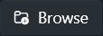

<p align="center">
  
  
  
  
</p>
<p align="center">
  
    
  
</p>
<p align="center">
  
  
  
</p>


_MFS Apps Control is a Windows app with a modern graphical interface that lets you define a list of apps to automatically start and/or stop alongside Microsoft Flight Simulator._\
_While it is possible to start third-party apps via the exe.xml, most of them will remain open after closing MFS because they do not track the simulator's state. This utility automates and optimizes this process, making it easier to configure._

- [Installation \& Usage](#installation--usage)
  - [Compatibility](#compatibility)
  - [Installation](#installation)
  - [Launching](#launching)
  - [Usage](#usage)
- [Developers](#developers)
  - [Requirements](#requirements)
  - [Stack](#stack)
  - [Project Structure](#project-structure)
  - [Environment Setup](#environment-setup)
    - [1. Fork \& Clone](#1-fork--clone)
    - [2. Create a dedicated branch](#2-create-a-dedicated-branch)
    - [3. Conventions](#3-conventions)
    - [4. Write \& Run unit tests](#4-write--run-unit-tests)
    - [5. Submit a Merge Request](#5-submit-a-merge-request)
- [License](#license)
- [Contact](#contact)

## Installation & Usage

### Compatibility

- Windows 10/11 64-bit (up to date)
- Microsoft Flight Simulator 2020/2024

### Installation

- Download the latest [Release](https://github.com/Stalex-CORP/MFSAppsControl/releases)
- Run the setup executable from the archive
  > [!NOTE]
  > As an occasional developer, I do not have a certificate to sign the setup (which is expensive and requires an annual fee) which will warned you it's from an untrusted editor. Microsoft has confirmed there is no virus inside and the installer & executable should be whitelisted now without a false positive detection on 8/20/2025, but it required to have your Windows Defender definitions up to date.
  >
  > All the source code is available here, including the file used to build the app & installer by an automated Github workflow.

### Launching

Once installed, the app will be available in your Start Menu under the **Stalex** folder as **MFS Apps Control**.

### Usage

Once launched:

1. Add your apps by clicking on .

   The list displayed is generated from apps installed on your system with some known exclusions (Microsoft, NVidia, etc...),

   but you can add any app/script (powershell, python, cmd) by clicking on 

2. Add args for the app if needed and click on 
3. Configure the options of app added to set start and/or stop automatically with MFS.

   A simulation mode is available to simulate start & stop of MFS without running it with  & .

4. Minimize the window to let the app goes to notification area and running in background.
   > [!TIP]
   > In background, the app will still perform start & stop tasks.
   >
   > Even if you have already launched an app manually outside, it will be able to close it if you have set the option.

## Developers

Thank you for your interest in contributing !

> [!CAUTION]
> I'm not a profesional developer, but I created this project to practice C# and WPF with vibe coding and because I need it.
>
> It should need some refactoring and improvements, but it work.
>
> If you want to help to optimize and reorganize, feel free to fork the project and submit a pull request.

### Requirements

- [.NET SDK X64 9.0](https://dotnet.microsoft.com/en-us/download)
- [Visual Studio Desktop with Desktop development tools](https://visualstudio.microsoft.com/)
- Windows 10/11 64-bit up to date (Linux not supported)
- **Good knowledge of C#, MVVM, WPF at least**

### Stack

- **C#** (.NET 9.0)
- **WPF**
- **WPF UI** (https://wpfui.lepo.co/)
- **log4net** (https://logging.apache.org/log4net/)
- **Inno Setup** (https://jrsoftware.org/isinfo.php)
- **Microsoft.Toolkit.Uwp.Notifications**
- **Automatic Versions 2 VS Tools** (https://marketplace.visualstudio.com/items?itemName=PrecisionInfinity.AutomaticVersions)

### Project Structure

```
.github/                                            # GitHub configuration folder (workflows, templates, etc.)

Docs/
│
├── images/                                         # images for readme files
│   └── ...png
├── MFSAppsControl_UserManual.pdf                   # PDF App User Manual
├── README-english.md                               # Detailed documentation (English)
└── README-french.md                                # Detailed documentation (French)

MFSAppsControl/
│
├── Converters/                                     # Value converters for WPF data binding
│   ├── CollectionLogConverter.cs                   # Converts objects to a log string
│   └── ExeIconToImageSourceConveter.cs             # Converts an icon file path to an ImageSource for WPF
│
├── Models/                                         # Data models used in the app
│   ├── ApplicationModel.cs                         # Represents an app with its properties (name, path, args, etc.)
│   └── AppConfigModel.cs                           # Represents the configured apps collection
│
├── Services/                                       # app services (business logic, system access, etc.)
│   ├── AppConfigService.cs                         # Service to manage app configuration
│   ├── ConfigugrationService.cs                    # Service to manage json app configuration
│   ├── LanguageService.cs                          # Manages language and translations
│   ├── LoggerService.cs                            # Logging service for the app
│   ├── MFSEventWatcher.cs                          # Service to watch for Microsoft Flight Simulator start/stop events
│   └── NotificationService.cs                      # Notification service to display system notifications of the app
│
├── ViewModels/                                     # MVVM app logic (ViewModels)
│   ├── Pages/
│   │   ├── ConfigAppsViewModel.cs                  # ViewModel for managing the list of apps and their configuration
│   │   └── AddAppViewModel.cs                      # ViewModel for adding a new app
│   └── Windows/
│       └── MainWindowViewModel.cs                  # Main ViewModel for the main window
│
├── Views/                                          # XAML views (UI)
│   ├── Pages/
│   │   ├── ConfigAppsPage.xaml                     # Page displaying the list of apps and their configuration
│   │   ├── ConfigAppsPage.xaml.cs                  # Code-behind for ConfigAppsPage.xaml
│   │   ├── AddAppPage.xaml                         # Page for adding a new app
│   │   └── AddAppPage.xaml.cs                      # Code-behind for AddAppPage.xaml
│   └── Windows/
│       ├── MainWindow.xaml                         # Main app window
│       └── MainWindow.xaml.cs                      # Code-behind for MainWindow.xaml
│
├── App.xaml                                        # Root definition of the WPF app (global resources)
├── App.xaml.cs                                     # app startup logic
├── AssemblyInfo.cs                                 # .NET assembly information
├── ExcludedVendors.json                            # List of apps to exclude from automatic detection
├── log4net.config                                  # log4net logger configuration
├── MFSAppsControl.csproj                           # .NET App project file (build configuration)
├── mfsappscontrol.iss                              # Inno Setup script to generate the Windows installer
└── Usings.cs                                       # Global usings to simplify C# files

MFSAppsControlTests/
│
├── Mocks/
│   ├── MockLoggerService.cs                        # Mock of Logger Service for create view models in tests
│   └── MockSnakbarService.cs                       # Mock of Snackbar Service for create view models in tests
│
├── AddAppViewModelTests.cs                         # Unit tests of AddAppViewModel
├── ConfigAppsViewModelTests.cs                     # Unit tests of ConfigAppsViewModel
├── MFSAppsControlTests.csproj                      # .NET Test project file (build configuration)
└── MSTestSettings.cs                               # .NET project settings

.gitignore
CHANGELOG.md                                        # Detailled changelog of releases
LICENSE.txt                                         # Project license (MIT)
mfsappscontrol.ico                                  # app icon for app, installer and readme
MFSAppsControl.sln                                  # Visual Studio solution (groups all projects)
preview-en.png                                      # Preview english capture of app for readme
preview-fr.png                                      # Preview french capture of app for readme
README.md                                           # Main documentation (redirects to sub-versions)
```

### Environment Setup

#### 1. Fork & Clone

```bash
git fork https://github.com/your-username/mfsapplinker.git
git clone https://github.com/your-username/mfsapplinker.git
```

#### 2. Create a dedicated branch

- New Feature

```bash
git checkout -b feature/name
```

- Bug Fix

```bash
git checkout -b fix/name
```

#### 3. Conventions

- Follow the project structure (unless refactoring is needed).
- Always document your code.
- Ensure the app start and work without errors/warnings when you submit your PR.
- Follow linter rules to respect standard.
- Use MVVM, DataContext, RelayCommands, etc.
- Use explicit branch names: **feature/** or **fix/**
- Clear and concise commits, following conventions:
  - One commit per change (avoid large commits)
  - Start commit message with a relevant emoji and a space (see Tip)
  - Clear message with verb and subject (see Tip below)
    > [!TIP]
    > Conventional commit message: https://www.conventionalcommits.org/en/v1.0.0/#summary
    >
    > Recommended emoji extension: https://marketplace.visualstudio.com/items?itemName=seatonjiang.gitmoji-vscode

#### 4. Write & Run unit tests

- If new feature, you need to create tests as possible.
- They must be all green, else there is a regression to fix.

#### 5. Submit a Merge Request

- Describe your changes precisely.
- Link related issues if needed.
- Ensure build passed without errors/warnings.

## License

This project is licensed under the MIT License. See [LICENSE](LICENSE).

## Contact

For any questions or suggestions:

GitHub Issues: https://github.com/Stalex-CORP/MFSAppsControl/issues
