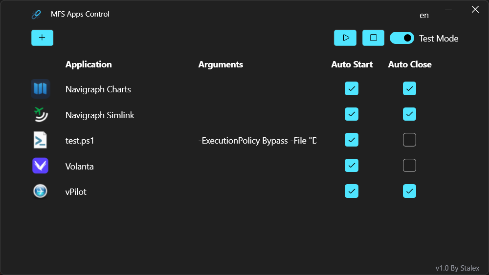

<!-- Badges -->

  
  
  
  

  
    
  

  
  
  

#  MFS Apps Control

  

### EN
MFS Apps Control is a Windows application with a modern graphical interface that lets you define a list of applications to automatically start and/or stop alongside Microsoft Flight Simulator. While it is possible to launch third-party apps via the exe.xml, most of them remain open after closing MFS because they do not track the simulator's state. This utility automates and optimizes this process, making it easier to configure.

 

### FR
MFS Apps Control est une application Windows avec une interface graphique permettant de définir une liste d'application à lancer et/ou arrêter en même temps de Microsoft Flight Simulator et tout cela dans une interface moderne.
MFS permet déjà de démarrer des applications via le exe.xml, mais la plupart resteront ouverte à la fermeture de MFS car ils ne suivent pas l'état de MFS. C'est pourquoi, cette utilitaire le fera automatiquement et de manière plus optimisée et plus facile à configurer.

 

