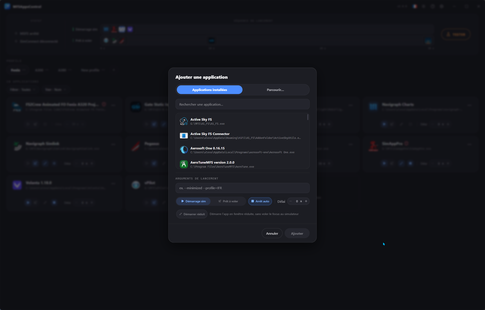
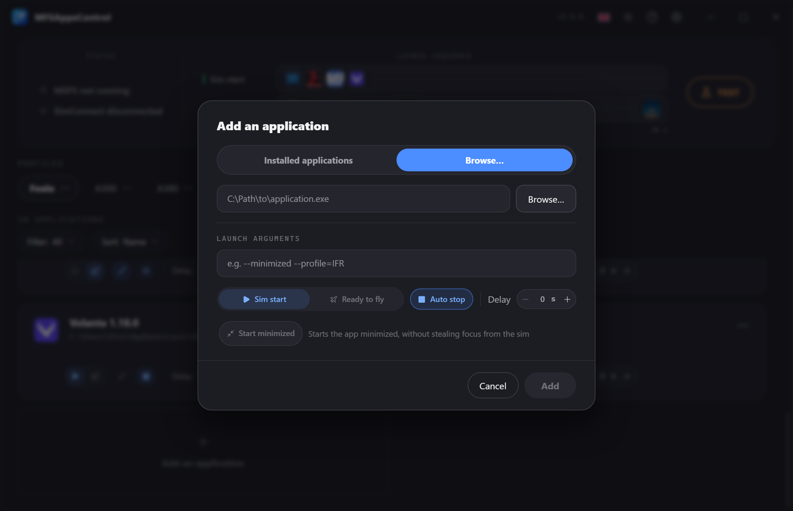
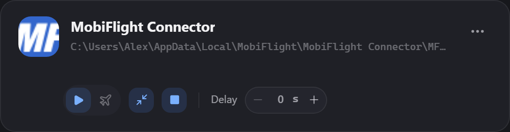
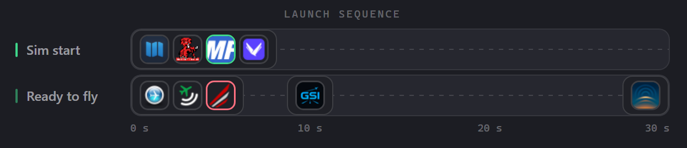
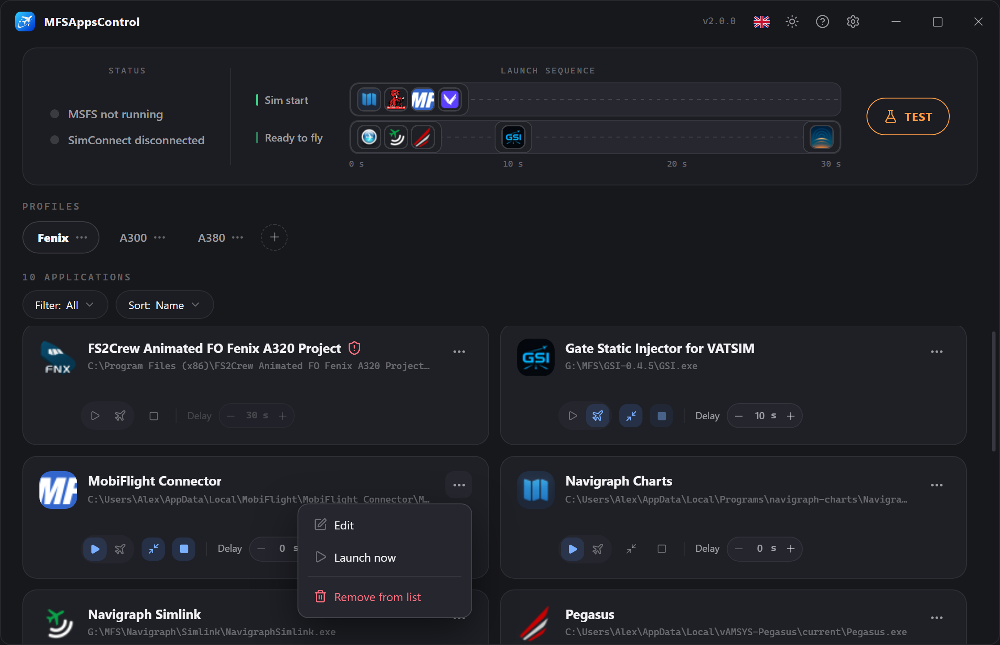
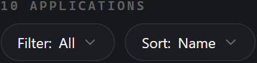

# Applications & sequence

Every application in your profile is shown as a **card**.<br>
This page covers how to add them, how to configure them, and how to read the **launch sequence**.

---

## Adding an application

Click **Add an application** in the grid. Two modes:

=== "Installed applications"

    Lists the software already installed on your PC (via the Windows registry).<br>
    Search for it and select it: the name, the icon and the path are retrieved automatically.

    

    !!! note "The list is deliberately filtered"
        To stay readable, the list leaves out software unrelated to flying
        (system drivers and utilities, browsers, games, launchers, etc.) and
        hides the applications **already in the active profile**. A normally
        installed application that doesn't show up — or a **portable**
        program — can always be added from the **Browse** tab.

=== "Browse"

    Type the path to an `.exe`, or click **Browse…** to pick it: the name and the icon are retrieved automatically.

    

    !!! note "When to use it"
        This mode is for **portable** applications (not installed) or undetected ones that don't appear in the Windows registry.

The add window then holds the **launch arguments**, the **trigger**, the **delay** and the **Start minimized** option, all of them editable after adding.

---

## Anatomy of a card



**At the top**, the application's information:

- The application icon
- Its **name**
- Its **path**
- Its **arguments** (under the path, when set).
  
On the right, the **status badge** (visible while running) and the **:material-dots-horizontal:** menu.

**At the bottom, the control bar**, one click away:

| Control                                       | Role                                                                                                              |
| --------------------------------------------- | ------------------------------------------------------------------------------------------------------------------- |
| :material-play: **Sim start**                 | Starts when the simulator launches.                                                                                 |
| :material-airplane: **Ready to fly**          | Starts when the **Ready to fly** screen is shown.                                                                   |
| :material-arrow-collapse: **Start minimized** | Launches the application in a minimized window.<br>*Shown only if an auto start is chosen*                         |
| :material-square: **Auto stop**               | Closes the application when the simulator stops.<br>*Auto-enabled and locked with the "Ready to fly" launch*      |
| :material-minus::material-plus: **Delay**     | Wait time before this application launches, counting from its start mode.                                           |

These settings are also available in the edit window.

### The two start triggers

This is the most useful setting in MFSAppsControl.<br>
The two buttons on the left (:material-play: and :material-airplane:) form a **single choice**: enabling one disables the other, and clicking the active one again **turns off auto start**.

|                      | :material-play: **Sim start**             | :material-airplane: **Ready to fly**         |
| -------------------- | ----------------------------------------- | -------------------------------------------- |
| **Fires**            | When the MSFS **process** is detected     | When your **aircraft appears in the world**  |
| **Detection**        | Through **process monitoring**            | Via **SimConnect**                           |
| **The delay starts** | From the simulator launch                 | From the "Ready to fly" screen               |
| **Typically for**    | Navigraph, vPilot, a hardware utility     | REX Atmos, FS2Crew, aircraft tools           |

!!! tip "How do you choose?"
    Ask yourself the right questions:<br>
    *"Does this application need to be in place/available before I start flying?"*<br>
    *"Does this application work without the simulator?"*<br>
    *"Is this application harmless to how my simulator runs?"*<br>

    - **Yes** → Sim start. It has to be in place before the flight begins.
    - **No** → Ready to fly. No point running it before you are in the flight.

**What you should know about the "Ready to fly" start**

!!! info "Auto stop is locked"
    A "ready to fly" application **always** closes with the simulator: the :material-square: button is locked in the active position.<br>
    An application launched for the flight has no reason to outlive the simulator.

!!! info "The trigger fires on the **Ready to fly** screen"
    In practice, this happens right after a flight has loaded, as soon as the "Ready to fly" screen is shown.
    It is the only safe way to detect a flight "cleanly".

!!! warning "SimConnect must be connected"
    **This trigger relies on SimConnect**.<br>
    If the SimConnect status is not **green** (SimConnect connected), "ready to fly" applications will not start.<br>
    If it goes a long time without connecting, it turns **red** ("SimConnect unavailable"). → [Troubleshooting](faq.md)

### Automatic stop

The :material-square: **Auto stop** button closes the application when the simulator stops.<br>
It is **independent** of the start: you can have an application that you launch by hand or by some other means, but that MFSAppsControl closes with the simulator.

The close is **clean**: MFSAppsControl first tries to close the application as if you had clicked its close button, gives it a few seconds to end its session, and only forces the close as a last resort.<br>
Applications that need to disconnect cleanly (Active Sky, for example) are therefore handled properly.

### Start minimized

The :material-arrow-collapse: **Start minimized** option launches the application in a **minimized window**, useful when it doesn't need to be in the foreground.

The button only appears if an **auto start** is chosen.

!!! note
    Some applications force their window to the foreground a few seconds after starting.<br>
    MFSAppsControl keeps trying to minimize them for a few seconds, but a few rare programs may resist.

### The delay

The **delay** is the wait time before the application launches, **counting from its trigger**. It lets you **space out** startups.

- Adjustable from **0 to 600 seconds** (10 minutes)
- The **−** / **+** buttons step by **5 s**, and you can also **type** the value directly
- The delay is **grayed out** if no auto start is chosen
- During a flight, it shows a **padlock** :material-lock: — the configuration is locked

!!! tip "Each trigger has its own sequence"
    A 30 s delay on a "sim start" application = 30 s after MSFS launches. <br>
    A 30 s delay on a "ready to fly" application = 30 s after the "Ready to fly" screen appears.

### Launch arguments

An optional field: the command-line parameters passed to the executable, separated by spaces (e.g. `--auto`).<br>
They are shown on the card, under the path.

The application is always launched from **its own installation folder**.

---

## The timeline

The center of the banner shows the **launch sequence**: which application starts when.<br>
It appears as soon as at least one application has auto start.



Each block represents a start moment, with the icons of the applications concerned.<br>
Hover a block to see their names and statuses.

Because the two triggers are independent, the timeline shows **two tracks**:

- One track for "sim start"
- One track for "ready to fly". 

### Two possible display styles

In [Options](options.md) → **Appearance** → **Sequence style**, you can pick the representation that speaks to you most:

- **Double** — two separate tracks, one for each sequence
- **Mono** — a single track split in two in the middle, one half for each sequence

## Card statuses

The card's **outline** and its **badge** show the state of the application

|                     Badge                     | Outline | Meaning                                                             |
| :-------------------------------------------: | :-----: | ------------------------------------------------------------------- |
|  |  blue   | The delay is counting down.<br>The badge shows the seconds left.   |
|     |  green  | The process is running.                                             |
|         |   red   | The launch failed.                                                  |
|                 *no badge*                    |         | Application stopped/inactive.                                       |

**Hover a badge** for more detail: the error badge gives the cause (executable not found, administrator rights required…), and the green badge shows the process **PID**.

### Canceling a launch

During a countdown, a cross **✕** appears next to the badge. It **cancels the launch** of that application only. The others carry on with their sequence as normal.

### Applications launched outside the program

MFSAppsControl regularly checks which processes are actually running.<br>
If you launch a configured application yourself (or close it), its card updates.<br>
It switches to a green **RUNNING** without MFSAppsControl having launched it.

In that case, the badge tooltip shows the **PID** of the adopted process:

```
Process active
PID 24680
```

## Editing or acting on an application

Open the card's **:material-dots-horizontal:** menu, or **right-click** it:

| Entry                                       | Effect                                                        |
| ------------------------------------------- | -------------------------------------------------------------- |
| :material-square-edit-outline: **Edit**     | Reopens the settings window, pre-filled.                       |
| :material-play: **Launch now**              | Starts the application immediately, with no delay.             |
| :material-stop-circle: **Stop**             | Stops the running process (replaces "Launch now").             |
| :material-delete: **Remove from list**      | Deletes the application from the profile.                      |



## Filter and sort

The bar above the grid offers two menus:

- **Filter** — *All*, *MSFS start* (auto-start applications),
  *MSFS stop* (auto-stop applications), *Ready to fly* (applications on the
  SimConnect trigger).
- **Sort** — by *Name* (alphabetical) or by *Delay* (ascending).

These settings change **the display only**; they affect neither the launch sequence nor the profile.



## During a flight, the configuration is locked

As soon as the simulator is detected, the profile and the applications are **locked** (padlock :material-lock:{ style="color:#3ecf8e" }).<br>

You can still **launch** or **stop** an application by hand from the **:material-dots-horizontal:** menu.

## Applications requiring administrator

Some applications require **administrator rights** (Active Sky or REX Atmos, for example).<br>
They show a **shield** <span style="color:red;">:material-shield-alert:</span> next to their name.

When such an application is in the active profile, you are asked to **restart as administrator** at launch or when adding it, through **a single** UAC prompt.

!!! info "Only the applications that require it are elevated"
    Even when MFSAppsControl runs as administrator, it does **not** pass those rights on to everything it launches.<br>
    Each application starts with the rights **its own executable** asks for; only those that genuinely require administrator get it.

!!! tip "If you decline the elevation"
    MFSAppsControl keeps working normally, but administrator applications **will not be launched**.<br>
    Their card shows the error "MFSAppsControl must be run as administrator".<br>
    Nor will it be able to close them when the simulator stops.

## Invalid path / launch error

If an application's executable is **not found** (moved/uninstalled), or if an error occurs at launch, its card switches to a **red error** state, with the details in the badge information.

That application is then:

- **skipped by the launch sequence** (no start attempt);
- **excluded from process detection**.

## Testing the sequence

The **Test** button plays **the whole** sequence without launching the simulator.<br>
Only the simulator starting and stopping is simulated: your applications really are launched.

Here is the flow:

1. The status switches to the blue "simulator detected" state.
2. After **5 s**, the status moves to "running". The **Sim start** sequence fires according to the configured delays, with **SimConnect connected**, as in a real session where SimConnect comes up during loading.
3. A **"Ready to fly in 10s…"\*** countdown appears under the button: this is the simulated time to reach the "Ready to fly" screen.<br> **\*** The countdown only appears if your profile contains at least one valid **Ready to fly** application.
4. When it runs out, the **Ready to fly** sequence fires in turn, according to the configured delays.

The button becomes **Stop** right from the start: click it to end the test and close every auto-stop application that is already running.<br>
It **locks** while they close — some applications take a few seconds to shut down cleanly — then turns back into **Test**.

!!! note
    Careful: applications that were already running before the test are also **closed** if they are set to auto stop. The test makes no distinction between applications launched by MFSAppsControl and those launched by hand.
