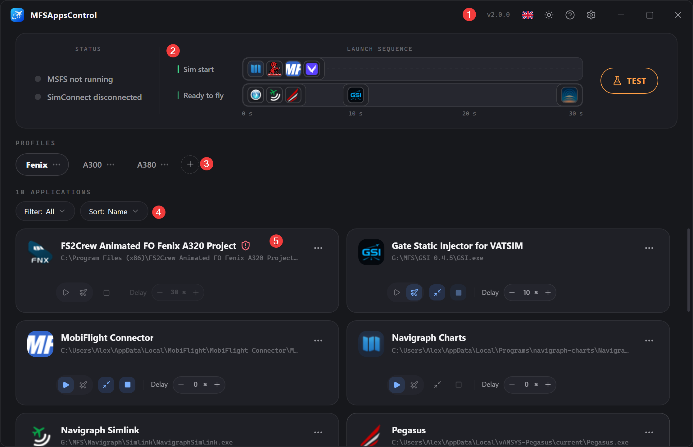
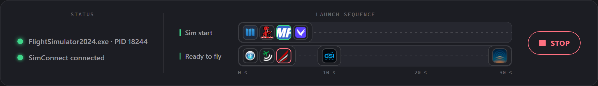
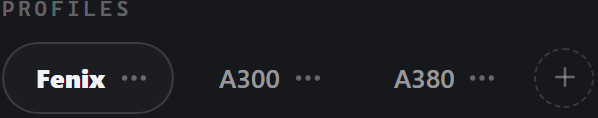

# Erste Schritte

MFSAppsControl beruht auf einer einzigen Idee: 
Die Anwendungen, die mit Ihrem Simulator starten und/oder stoppen sollen, verwalten, ohne dass Sie daran denken müssen.

---

## Der Hauptbildschirm

### 1. Die Titelleiste

Links das Logo mit dem Namen der Anwendung. 
Rechts, von links nach rechts:

- die **Version** (vX.Y.Z),
- die Sprache (:flag_gb:),
- das **Design** (:material-weather-sunny:),
- die **Hilfe** (:material-help-circle:),
- die **Optionen** (:material-cog:),
- und die Schaltflächen zur Fenstersteuerung (:material-window-minimize:, :material-window-maximize:, :material-window-close:).

Sobald eine neue Version verfügbar ist, erscheint neben der Version ein **Badge**. Ein Klick darauf startet den Download und die Installation.

### 2. Das Status- und Sequenzband

Hier sehen Sie auf einen Blick:

- den Zustand des Simulators und der SimConnect-Verbindung,
- die Startsequenz der Anwendungen,
- die Schaltfläche zum Testen der Sequenz.

**Links die Statusanzeigen** — MSFS und SimConnect. 

- MSFS-Status

  | Punkt                                            | Bezeichnung                          | Beschreibung                                    |
  | ------------------------------------------------ | ------------------------------------ | ----------------------------------------------- |
  | :material-circle:{ style="color:#8a8f98" } grau  | **MSFS nicht aktiv**                 | Der Simulator läuft nicht bzw. wird nicht erkannt. |
  | :material-circle:{ style="color:#4a9eff" } blau  | **Addons werden gestartet…**         | Der Prozess des Simulators wurde erkannt.       |
  | :material-circle:{ style="color:#3ecf8e" } grün  | `FlightSimulator2024.exe · PID 1234` | Die Prozessinformationen wurden ausgelesen.     |

- SimConnect-Status

  | Punkt                                            | Bezeichnung                     | Beschreibung                                      |
  | ------------------------------------------------ | ------------------------------- | ------------------------------------------------- |
  | :material-circle:{ style="color:#8a8f98" } grau  | **SimConnect getrennt**         | Warten auf den Start des Simulators.              |
  | :material-circle:{ style="color:#3ecf8e" } grün  | **SimConnect verbunden**        | Verbindung hergestellt, System bereit.            |
  | :material-circle:{ style="color:#ff5c5c" } rot   | **SimConnect nicht verfügbar**  | SimConnect antwortet nicht (siehe [FAQ](faq.md)). |

**In der Mitte die Startsequenz** 
Die Zeitleiste Ihrer Anwendungen, dargestellt durch ihre Symbole, verteilt auf ihre Startverzögerungen (nur sichtbar, wenn mindestens eine Anwendung konfiguriert ist). → [Die Zeitleiste im Detail](applications.md#die-zeitleiste)

**Rechts die Schaltfläche Testen/Stoppen** 
Damit simulieren Sie den Start und das Beenden von MSFS, um die Sequenzen zu testen, ohne MSFS zu starten. 
Während eines Fluges oder eines Tests wird sie zu **Stoppen**. → [Die Sequenz testen](applications.md#die-sequenz-testen)

### 3. Die Profile

Zeigt alle Ihre verfügbaren Profile an, wobei das aktive Profil hervorgehoben ist.

Eine Schaltfläche zum **Erstellen** eines neuen Profils. 
Die Tabs lassen sich durch Ziehen neu anordnen. 
Über das Menü **:material-dots-horizontal:** können Sie sie umbenennen, duplizieren oder löschen. → [Profile](profiles.md)

### 4. Die Filter

Zeigt die Anzahl der Anwendungen an und ermöglicht es, die Liste zu filtern und zu sortieren.

- **Filtern**: Alle / MSFS-Start / MSFS-Stopp / Startbereit
- **Sortieren**: Name / Verzögerung

Diese Einstellungen betreffen ausschließlich die Anzeige.

### 5. Die Anwendungen

Jede konfigurierte Anwendung wird durch eine **Karte** dargestellt.

Eine **Karte** zeigt die Informationen der Anwendung und ihre Konfiguration. → [Aufbau einer Karte](applications.md#aufbau-einer-karte)

---

## Ihre erste Konfiguration

### 1. Das Standardprofil

Beim ersten Start wartet ein leeres **Standardprofil** auf Sie. 
Verwenden Sie es unverändert, benennen Sie es um oder erstellen Sie weitere nach Ihren Bedürfnissen. → [Profile](profiles.md)

### 2. Fügen Sie eine Anwendung hinzu

Klicken Sie auf die Karte **Anwendung hinzufügen**. 
Wählen Sie die Anwendung aus → [Eine Anwendung hinzufügen](applications.md#eine-anwendung-hinzufugen):

- aus der Liste der **installierten Anwendungen**
- oder über den Pfad ihrer `.exe` mit **Durchsuchen…**

### 3. Legen Sie die Steuerungsoptionen fest

Das ist die wichtigste Einstellung. Im Hinzufügen-Dialog bietet die Zeile **Auslöser**:

- **Simstart** :material-play:, um die Anwendung mit dem Simulator zu starten (MobiFlight, Navigraph…).
- **Startbereit** :material-airplane:, um sie zu starten, sobald Sie im Flugzeug sitzen (REX Atmos, vPilot…).

Keine der beiden Optionen ist Pflicht; die Schaltfläche **Autostopp** :material-stop: beendet die Anwendung zusammen mit dem Simulator. (Wird automatisch aktiviert, wenn die Anwendung im Modus „Startbereit“ gestartet wird.)

### 4. Stellen Sie die Verzögerung ein

Die **Verzögerung** schiebt den Start ab dem gewählten Auslöser nach hinten. → [Die Verzögerung](applications.md#die-verzogerung)

### 5. Testen Sie

Klicken Sie auf **Testen**: Die Sequenz läuft ab, als würde der Simulator starten.  
Ein Countdown **„Startklar in 10s…“** simuliert die SimConnect-Verbindung nach 10 s.

Klicken Sie auf **Stoppen**, um den Test zu beenden und die Anwendungen zu schließen, für die die Option gesetzt ist.

## Der Ablauf eines Fluges

| Zeitpunkt                                            | Was MFSAppsControl tut                                                                                                                                                    |
| ---------------------------------------------------- | ------------------------------------------------------------------------------------------------------------------------------------------------------------------------- |
| Sie starten **MSFS**                                 | Der MSFS-Status wird blau.                                                                                                                                                |
| Der Simulator lädt                                   | Der MSFS-Status wird grün, der SimConnect-Status wird grün, sobald die Verbindung verfügbar ist, und die Simstart-Anwendungen werden gemäß ihrer Verzögerung gestartet.  |
| Sie erreichen den Bildschirm **Startbereit** eines Fluges | Nun läuft die Sequenz **Startbereit** an, mit ihren eigenen Verzögerungen.                                                                                            |
| Sie wechseln den Flug                                | Die Anwendungen **starten nicht erneut**, sie bleiben aktiv.                                                                                                              |
| Sie beenden **MSFS**                                 | Alle Anwendungen mit **Autostopp** (einschließlich der an den Modus „Startbereit“ gekoppelten) werden sauber geschlossen.                                                  |

!!! info "Wenn MSFS schon läuft, bevor MFSAppsControl gestartet wird"
    Die Sequenz wird **nicht ausgelöst**! Sie wird beim nächsten Start von MSFS scharf geschaltet. 
    Dieser Fall ist zu komplex, als dass ein korrekter, störungsfreier Start garantiert werden könnte. 
    Bereits laufende Anwendungen werden trotzdem erkannt und beim Beenden des Simulators sauber geschlossen, sofern die Option aktiviert ist.  
    **Tipp**: Sie können eine Anwendung jederzeit manuell über das Menü **:material-dots-horizontal:** ihrer Karte oder außerhalb der Anwendung starten.

---

## Immer bereit

Aktivieren Sie **Beim Windows-Start ausführen** und **Minimiert im Infobereich starten** in den [Optionen](options.md). 
Danach können Sie MFSAppsControl vergessen oder es einfach öffnen, um vor Ihrem Flug das Profil zu wechseln.

