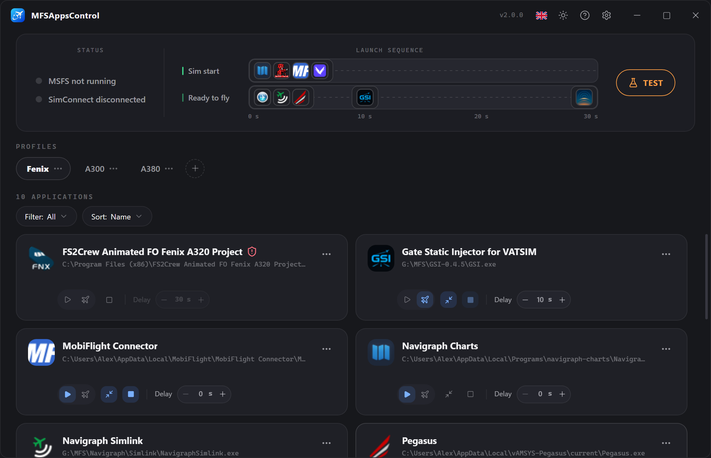

# MFSAppsControl

## Descrizione

**MFSAppsControl** è un'applicazione che permette di **avviare e/o arrestare** le applicazioni di terze parti monitorando lo stato di Microsoft Flight Simulator 2024/2020. 
Non dovrai più avviare le tue applicazioni una per una prima di ogni volo: configurale una volta e MFSAppsControl pensa a tutto.

## Come funziona

MFSAppsControl segue il tuo volo dall'inizio alla fine, in **tre fasi**:

::timeline::

- title: Avvio del simulatore
  content: Le applicazioni impostate su **Avvio sim** partono non appena il simulatore viene avviato, secondo il ritardo definito.
  icon: ' :material-numeric-1: '

- title: Schermata «Pronto al volo»
  content: Le applicazioni impostate su **Pronto al volo** partono non appena compare il pulsante «Pronto al volo», secondo il ritardo definito.
  icon: ' :material-numeric-2: '

- title: Arresto del simulatore
  content: Le applicazioni impostate su **Arresto auto** si chiudono in modo pulito alla chiusura del simulatore.
  icon: ' :material-numeric-3: '

::/timeline::

**La differenza tra i due tipi di avvio è il cuore dell'applicazione:** 
Alcune applicazioni possono:

- Essere avviate **fin dall'avvio** del simulatore (es. Navigraph, Volanta…)
- Avere vincoli / essere utili solo **durante un volo** (es. REX Atmos, FS2Crew…)

Sta a te scegliere ciò che si adatta meglio all'applicazione. → [Applicazioni e sequenza](applications.md#i-due-attivatori-di-avvio)

## Le funzionalità

- :material-rocket-launch: **Sequenza automatica** 
  Ogni applicazione parte secondo il proprio attivatore dopo il ritardo definito, visualizzato direttamente sulla timeline per l'ordine di avvio.

- :material-folder-multiple: **Profili** 
  Raggruppa le tue applicazioni per uso (A320, VFR, cargo…) e cambia con un clic. Il profilo mostrato è il profilo attivo.

- :material-tray-arrow-down: **Discreto** 
  Può essere ridotto nell'area di notifica e avviarsi con Windows, per essere pronto in ogni momento ai tuoi prossimi voli senza pensarci.

- :material-translate: **Interfaccia completamente multilingue** 
  Tradotta interamente in francese, inglese, tedesco, spagnolo, italiano e portoghese, con cambio in tempo reale e salvataggio nella configurazione.

- :material-shield-check: **Applicazioni amministratore** 
  Rilevate automaticamente al momento dell'aggiunta, con una richiesta di Windows. Solo le applicazioni che necessitano di privilegi amministrativi useranno la modalità amministratore.

- :material-flask: **Modalità test** 
  Riproduci tutta la sequenza (attivatore «pronto al volo» incluso) senza avviare il simulatore, per verificare i tuoi profili.

## Da dove iniziare?

1. [**Installazione**](installation.md) — scaricare e installare l'applicazione.
2. [**Per iniziare**](getting-started.md) — configura la tua prima sequenza.
3. [**Applicazioni e sequenza**](applications.md) — il dettaglio delle varie parti dell'applicazione.
4. [**Profili**](profiles.md) e [**Opzioni**](options.md) — gestisci i tuoi profili e le tue impostazioni.
5. [**FAQ**](faq.md) — le domande più frequenti.
6. [**Supporto**](support.md) — per le richieste di assistenza.
