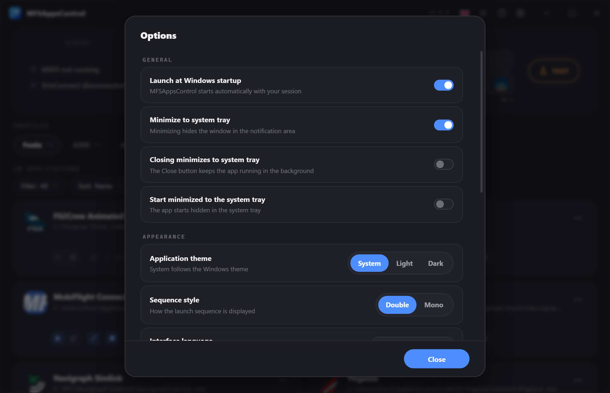

# Options

Ouvrez les options avec l'icône **engrenage** :material-cog: de la barre de titre,
ou depuis le menu de l'icône dans la zone de notification.

Tous les réglages sont **enregistrés immédiatement** — il n'y a pas de bouton
« Appliquer ».

## Général

| Option                                        | Effet                                                                                             |
| --------------------------------------------- | ------------------------------------------------------------------------------------------------- |
| **Lancer au démarrage de Windows**            | Démarre automatiquement avec votre session windows.                                               |
| **Réduire dans la barre système**             | Réduit la fenêtre dans la zone de notification (tray) au lieu de rester dans la barre des tâches. |
| **La fermeture réduit dans la barre système** | Fermer réduit la fenêtre dans la zone de notification (tray) au lieu de se fermer.                |
| **Démarrer réduit dans la barre système**     | Démarre directement dans le tray, fenêtre masquée.                                                |

!!! info "Comment fermer vraiment l'application si la fermeture réduit dans la zone de notification ?"
    Si **La fermeture réduit dans la barre système** est activée, la croix ne ferme plus l'application. 
    Utilisez **Quitter** dans le menu de l'icône de la zone de notification (clic droit).

## Apparence

### Thème de l'application

*Système* (suit le style de Windows), *Clair* ou *Sombre*. 
Le bouton :material-weather-sunny:/:material-weather-night: de la barre de titre bascule aussi rapidement le thème.

### Style de la séquence

Choisit la représentation de la [séquence](applications.md#la-timeline) :

- **Double** — Deux pistes indépendantes qui affiche chaque séquence.
- **Mono** — Une seule piste séparée au milieu pour chaque séquence.

### Langue de l'interface

Traduction complète en : Français, anglais, allemand, espagnol, italien, portugais. 
Appliquée immédiatement, sans redémarrage nécessaire et persisté dans la configuration.  
Disponible également dans la barre de titre avec le drapeau de la langue en cours. 

!!! info
    Défini automatiquement selon la langue de Windows au premier lancement, mais peut être changé à tout moment.

## Mises à jour

- **Vérifier automatiquement les mises à jour** — active la vérification automatique chaque jour.
- **Vérifier maintenant** — lance une recherche immédiate. Le résultat s'affiche sous le libellé (à jour / nouvelle version disponible).

!!! info
    Quand une mise à jour est disponible, un **badge** apparaît dans la barre de titre ; un clic dessus lance le téléchargement et l'installation.

## Débogage

### Niveau de journalisation

Détermine le détail écrit dans les fichiers journaux. Le changement s'applique **immédiatement**, sans redémarrer l'application.

| Niveau                | Contenu                                                        | Quand l'utiliser        |
| --------------------- | -------------------------------------------------------------- | ----------------------- |
| **Erreur** *(défaut)* | Erreurs et avertissements uniquement.                          | En usage normal.        |
| **Debug**             | + le déroulé des opérations (détections, lancements, arrêts…). | Sur demande du support  |
| **Trace**             | + le détail des valeurs internes. Très lourd.                  | Sur demande du support. |

Un nouveau fichier est créé **chaque jour**, et les journaux de plus de **7 jours** sont supprimés automatiquement.

!!! tip
    Pensez à **remettre le niveau sur Erreur** une fois votre problème soumis : les niveaux Debug et Trace sont très lourds.

### Exporter

Crée un fichier **`zip`** contenant tous vos journaux **et** votre configuration nécessaire à des fins de support.

### Réinitialiser l'application

Efface **tous vos profils et réglages** et repart à zéro comme à l'installation. 
**Une confirmation explicite est demandée.**

!!! danger "Action irréversible"
    Rien n'est récupérable après une réinitialisation. 

## À propos

Affiche le détail de l'application et les liens rapides vers **Discord**/**Flightsim.to**.
