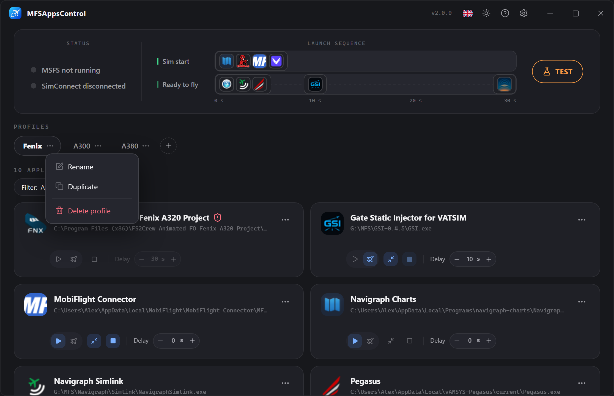
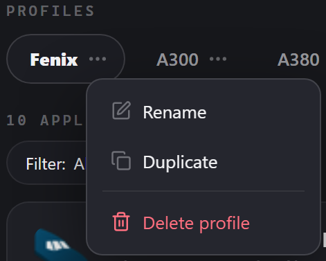
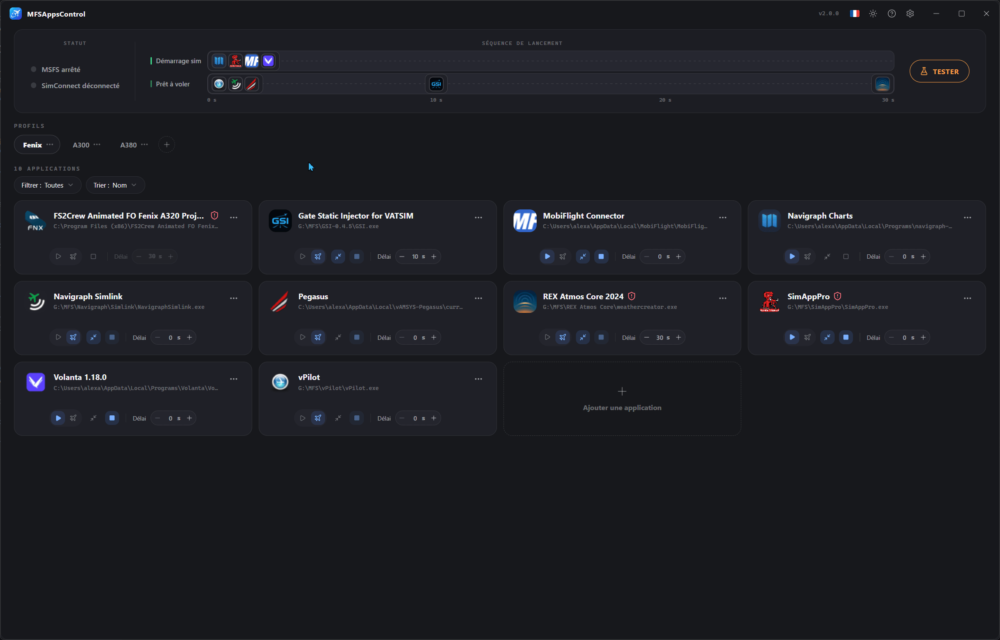
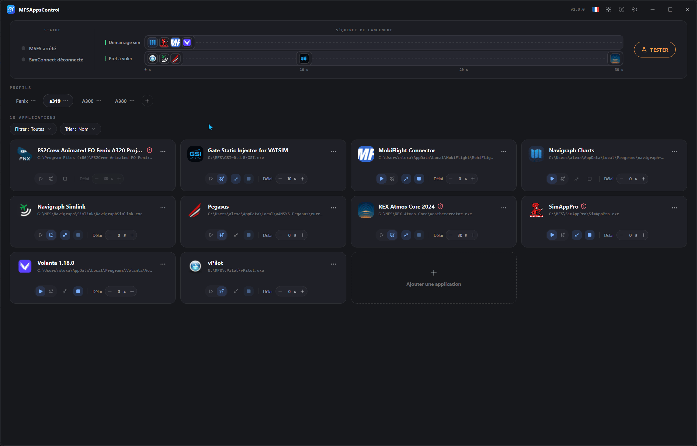
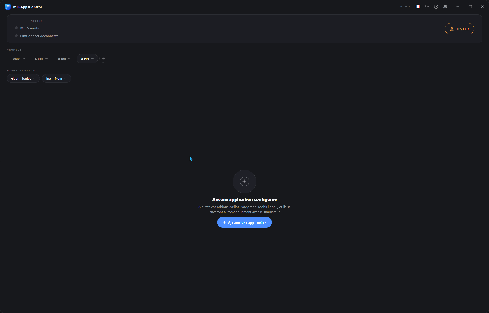
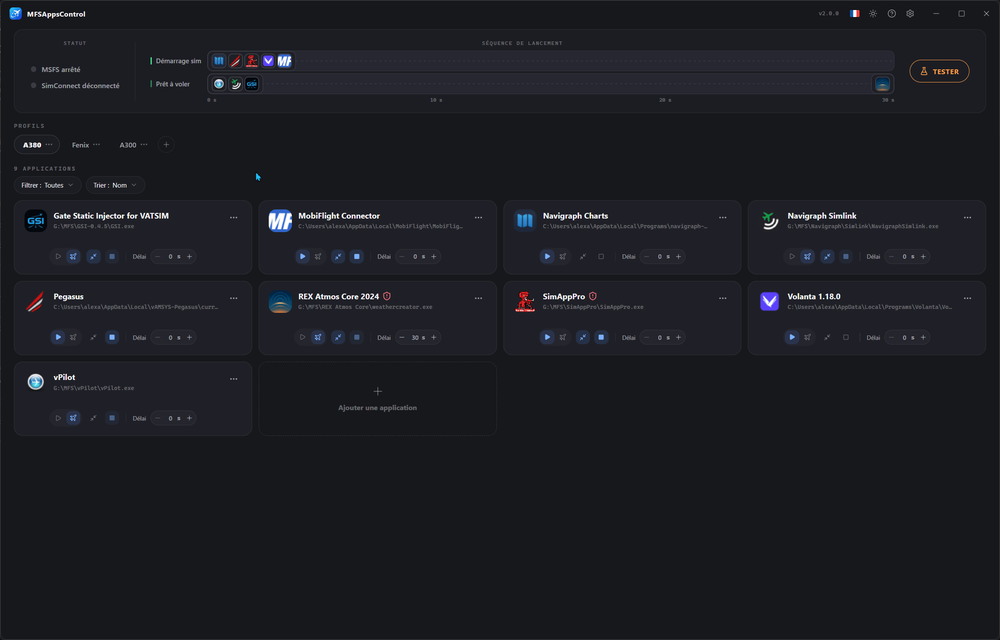

# Profile

Ein **Profil** fasst eine Reihe von Anwendungen samt ihren Einstellungen zusammen. 
Legen Sie mehrere davon nach Einsatzzweck an (Online-IFR-Flug, VFR, A320, A380…) und wechseln Sie mit einem Klick zwischen ihnen.

!!! info "Das aktive Profil steuert die Sequenz"
    Das **angezeigte** Profil ist dasjenige, das MFSAppsControl für die Sequenz ausführt. 
    Das Profil, das beim Start des Simulators gerade verwendet wird, ist mit einem **:material-lock:{ style="color:#3ecf8e" }** gekennzeichnet.

## Ein Profil erstellen

Klicken Sie rechts neben den Tabs auf die Schaltfläche **:material-plus-circle-outline:**. 
Ein neues, leeres Profil wird angelegt und Sie werden aufgefordert, es zu benennen.

!!! note "Eindeutiger Name und Abbrechen"
    Zwei Profile dürfen nicht **denselben Namen** tragen. 
    Solange der eingegebene Name bereits vergeben ist, wird das Feld **rot** und die Bestätigung ist blockiert. 
    Zum **Abbrechen** klicken Sie auf das Kreuz **:material-close-circle:** oder drücken **Esc**.

## Kontextmenü

Auf jedem Profil-Badge erreichen Sie über **:material-dots-horizontal:** oder einen **Rechtsklick** ein Menü.
Darüber können Sie das Profil **umbenennen**, **löschen** oder **duplizieren**.

### Ein Profil duplizieren

Um von einem bestehenden Profil auszugehen, ohne alles neu einrichten zu müssen.
Es wird eine Kopie mit **allen Anwendungen und deren Einstellungen** erstellt, benannt als „*Profilname* (Kopie)“, die Sie auf einen eindeutigen Namen umbenennen.

### Ein Profil umbenennen

Auch beim Umbenennen muss der Name **eindeutig** sein; andernfalls bleibt die Bestätigung blockiert.

### Ein Profil löschen

Das Löschen eines Profils ist **unwiderruflich** und entfernt **alle darin enthaltenen Anwendungen und Einstellungen**. 
Das letzte verbleibende Profil lässt sich nicht löschen.

### Neu anordnen

**Ziehen Sie die Badges** per Drag-and-drop, um ihre Reihenfolge zu ändern.
Das ist rein optisch und hilft Ihnen, Ihre bevorzugten Profile schneller wiederzufinden.

## Automatische Sperre

Die Profile werden **gesperrt** (auf dem aktiven Profil erscheint ein :material-lock:{ style="color:#3ecf8e" }), damit während der Ausführung nichts geändert werden kann.
